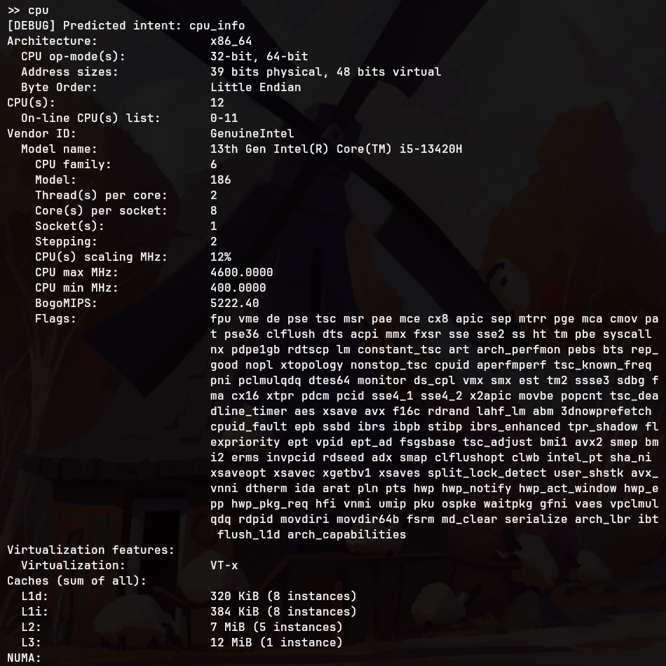
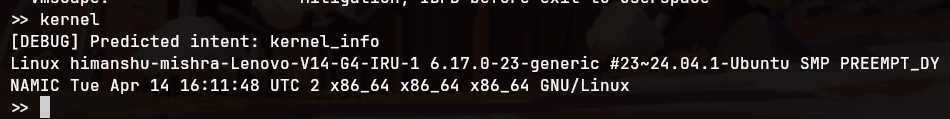
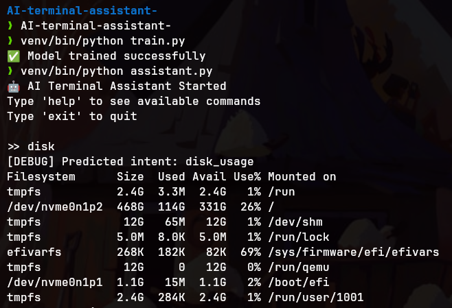

# AI Terminal Assistant

AI Terminal Assistant is a small Python project that lets a user interact with a Linux terminal using simple natural-language phrases instead of remembering exact shell commands.

For example, a user can type:

```text
disk usage
cpu info
kernel info
who am i
```

and the assistant predicts the user's intent, then runs the matching safe system-information command.

## Why this project is useful

This project is useful because it:

- makes common terminal tasks easier for beginners
- shows how a simple machine-learning classifier can be connected to real commands
- demonstrates intent classification using `TF-IDF` and `LogisticRegression`
- provides a safer way to experiment with natural-language terminal control by using only non-destructive commands

It is a good learning project for anyone interested in Python, machine learning, Linux commands, or building assistant-style tools.

## How the project works

The project has a small pipeline:

```text
User input
   ↓
assistant.py
   ↓
model.py predicts the intent
   ↓
commands.py runs the matching safe command
```

### Main files

| File | Purpose |
|---|---|
| `assistant.py` | Starts the assistant, reads user input, and passes it to the command handler. |
| `commands.py` | Contains the supported safe actions that can be executed. |
| `intents.json` | Stores example phrases for each supported intent. |
| `workspace/` | Safe folder for files that can be edited, made executable, or run. |
| `train.py` | Trains the classifier from the phrases in `intents.json`. |
| `model.py` | Loads the saved model and predicts the intent for new user input. |
| `vectorizer.pkl` | Saved TF-IDF vectorizer created during training. |
| `intent_model.pkl` | Saved trained intent classifier. |
| `run.sh` | Helper script for starting the assistant. |
| `HOW_TO_RUN.txt` | Short plain-text run instructions. |

## Supported safe commands

The assistant supports informational commands plus three intentionally limited file actions.

| Intent / input | What it does |
|---|---|
| `list_files` | Shows files in the current directory with `ls`. |
| `current_dir` | Shows the current directory with `pwd`. |
| `disk_usage` | Shows storage usage with `df -h`. |
| `memory_usage` | Shows memory usage with `free -h`. |
| `date_time` | Prints the current date and time. |
| `system_uptime` | Shows how long the system has been running with `uptime`. |
| `kernel_info` | Shows kernel/system details with `uname -a`. |
| `cpu_info` | Shows CPU details with `lscpu`. |
| `current_user` | Shows the logged-in user with `whoami`. |
| `hostname` | Shows the machine name with `hostname`. |
| `os_info` | Shows Linux distribution details with `lsb_release -a`, or `/etc/os-release` as a fallback. |
| `gpu_info` | Shows GPU-related entries from `lspci` when available. |
| `battery_info` | Reads non-destructive battery status from `/sys/class/power_supply`. |
| `network_info` / `ip_address` | Shows network interfaces and IP addresses with `ip addr show`. |
| `logged_in_users` | Shows logged-in users with `who`. |
| `running_processes` | Shows the ten largest processes by memory usage. |
| `environment_info` | Prints selected environment variables such as `USER`, `HOME`, and `PATH`. |
| `shell_info` | Shows the current shell from the `SHELL` environment variable. |
| `python_version` | Shows the installed Python version with `python3 --version`. |
| `package_manager_info` | Detects common package managers such as `apt`, `dnf`, and `pacman`. |
| `fastfetch_info` | Runs `fastfetch` if installed; otherwise falls back to `uname`, `lscpu`, `free`, and `df`. |
| `touch filename` or `create file filename` | Creates one file in the current project directory. |
| `mkdir foldername` or `create folder foldername` | Creates one folder in the current project directory. |
| `cp source destination` or `copy source to destination` | Copies one existing file to another simple filename in the current project directory. |
| `edit filename` | Opens `workspace/filename` in nano. |
| `open filename in nano` | Opens `workspace/filename` in nano. |
| `open filename in vim` | Opens `workspace/filename` in vim. |
| `make filename executable` | Runs `chmod +x` for a validated file inside `workspace/`. |
| `run filename` | Runs supported code files inside `workspace/` after asking for confirmation the first time. |
| `open_firefox` | Opens Firefox. |
| `calculator` | Opens the calculator application. |

## Safety: intentionally narrow file operations

This project blocks destructive or privileged commands such as:

```text
rm
rmdir
mv
chmod
chmod 777
chown
sudo
shutdown
reboot
kill
mkfs
dd
```

Those commands are blocked on purpose because they can delete data, alter permissions, stop the machine, or damage disks. The only permission change supported is the narrow phrase `make filename executable`, which runs `chmod +x` on a validated file inside `workspace/`.

For file actions, the assistant:

- accepts only simple names in the current project directory
- rejects names containing `/`, `..`, `~`, `*`, `?`, `&`, `|`, `;`, `$`, `` ` ``, `>`, or `<`
- asks for missing arguments instead of guessing
- uses Python APIs or `subprocess.run([...])` argument lists rather than passing raw user input to `shell=True`
- opens and runs files only inside `workspace/`
- allows only `nano` and `vim` as editors
- asks before running a file for the first time because code execution can be unsafe
- runs code with a 10 second timeout and captures stdout and stderr

Supported run types:

| Extension | Command used safely |
|---|---|
| `.py` | `python3 filename` |
| `.c` | `gcc filename -o filename_without_ext`, then the compiled program |
| `.cpp` | `g++ filename -o filename_without_ext`, then the compiled program |
| `.java` | `javac filename`, then `java ClassName` |
| `.js` | `node filename` |
| `.sh` | `bash filename` |

Examples:

```text
touch notes.txt
create file notes.txt
mkdir examples
create folder examples
cp notes.txt backup.txt
copy notes.txt to backup.txt
edit hello.py
open hello.py in nano
open hello.py in vim
make script.sh executable
run hello.py
```

The project also includes a confidence threshold in `model.py`. If the model is not confident enough about a phrase, it returns `unknown` instead of forcing an unrelated command.

## How to run the project

1. Open a terminal.
2. Move into the project directory:

```bash
cd AI-terminal-assistant-
```

3. If you changed `intents.json`, retrain the model:

```bash
venv/bin/python train.py
```

Use `venv/bin/python`, not plain `python3`, because the project dependencies such as `scikit-learn` are installed inside the virtual environment.

4. Start the assistant:

```bash
venv/bin/python assistant.py
```

You can also use the helper script:

```bash
./run.sh
```

## How to run the tests

The project now includes a small standard-library test suite for safe file handling, fallback command routing, and the new intents:

```bash
venv/bin/python -m unittest discover -s tests -v
```

To exit the assistant:

```text
exit
```

## Example phrases to try

```text
disk usage
os info
gpu info
battery info
network info
ip address
logged in users
running processes
environment info
shell info
python version
package manager info
fastfetch info
touch notes.txt
create file notes.txt
mkdir examples
create folder examples
cp notes.txt backup.txt
copy notes.txt to backup.txt
edit hello.py
open hello.py in nano
open hello.py in vim
make script.sh executable
run hello.py
```

## Proof that the model works

The screenshots below show the trained model correctly recognizing several supported inputs and safely rejecting an unknown one.

### Disk usage intent

The assistant predicts `disk_usage` and shows filesystem storage information:



### CPU information intent

The assistant predicts `cpu_info` and prints detailed processor information:



### Kernel information and unknown input handling

The assistant predicts `kernel_info` for a kernel query, and it also rejects unsupported text as `unknown` instead of running an unsafe or unrelated command:


### Workspace editor and run safety

The assistant shows the new help text, uses the safe workspace rules, asks before running code, and keeps unsupported command forms blocked:


### Clean exit

The assistant exits normally when the user types `exit`:



## Current limitations

- The model is trained on a small number of example phrases, so its vocabulary is still limited.
- It is designed for Linux systems and uses Linux-specific commands.
- It is a lightweight classifier-based assistant, not a large conversational AI model.

## Future improvements

Possible next steps include:

- adding automated tests for safety validation
- improving help output further
- increasing the number of training examples
- improving unknown-command detection further
- adding tests for intent prediction and command routing
